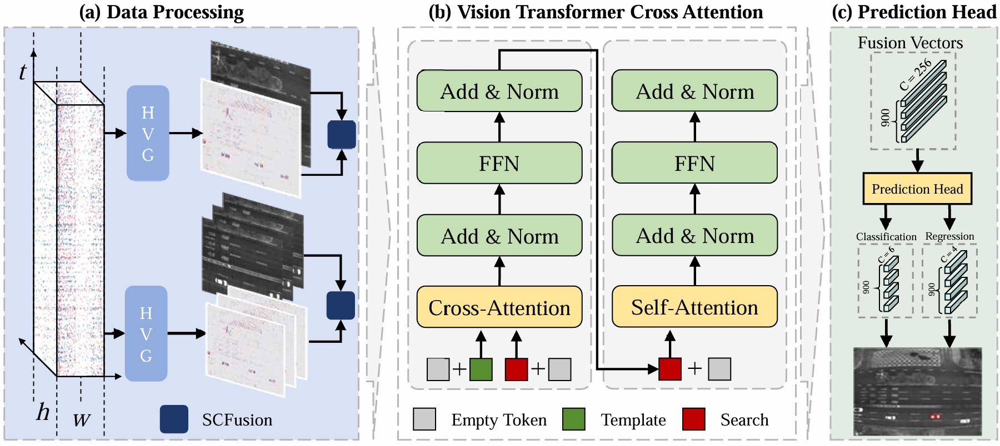

# EMTrack
EMTrack:Event-guide Multimodal Transformer for Challenging Single Object Tracking

## Highlights

### :star2: Architecture of our Transformer tracking framework

<p align="center">
  
</p>

 The framework is primarily composed of three fundamental components: Data Processing, Vision Transformer Cross Attention, and the prediction head. The Data Processing module incorporates the designed Hyper Voxel Grid (HVG) encoding method and SCFusion, which are detailed in the data preprocessing section. Meanwhile, the proposed cross-attention module is employed within the Siamese-based feature extraction and fusion backbone for enhanced feature integration.


## Conda Installation
We train our models under`python=3.8,pytorch=2.1.0,cuda=11.8`. 

```
conda create -n emtrack python=3.8
conda activate emtrack
bash install.sh
```

3.   For more detailed installation steps, please refer to [RTDETR](https://github.com/lyuwenyu/RT-DETR)


# Demo
1. We have put our model checkpoints here [ESVT: Goole Drive](https://drive.google.com/drive/folders/1CONoYjxOX9gsal1bxnj3PmixEKsv3p3L?hl=zh-cn)

2. Please download weights and organize them as following:
weights

&emsp;  └── ESVT/

&emsp;&emsp;&emsp;&emsp;&emsp; └── ESVT-sbfpn-6xd.pth

4.  Run train.py and the results in outputs.
