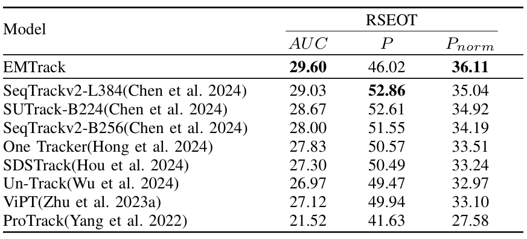

# EMTrack
EMTrack:Event-guide Multimodal Transformer for Challenging Single Object Tracking

## Highlights

### :star2: Architecture of our Transformer tracking framework

<p align="center">
  
</p>

 The framework is primarily composed of three fundamental components: Data Processing, Vision Transformer Cross Attention, and the prediction head. The Data Processing module incorporates the designed Hyper Voxel Grid (HVG) encoding method and SCFusion, which are detailed in the data preprocessing section. Meanwhile, the proposed cross-attention module is employed within the Siamese-based feature extraction and fusion backbone for enhanced feature integration.


## Conda Installation
We train our models under`python=3.8,pytorch=2.1.0,cuda=11.8`. 

```
conda create -n emtrack python=3.8
conda activate emtrack
bash install.sh
```


### :star2: Strong Performance

<p align="center">
  
</p>


## Set project paths
Run the following command to set paths for this project
```
python tracking/create_default_local_file.py --workspace_dir . --data_dir ./data --save_dir ./output
```
After running this command, you can also modify paths by editing these two files
```
lib/train/admin/local.py  # paths about training
lib/test/evaluation/local.py  # paths about testing
```

## Training

```
python tracking/train.py \
--script emt --config baseline \
--save_dir ./output \
--mode multiple --nproc_per_node 4 \
--use_wandb 1
```

